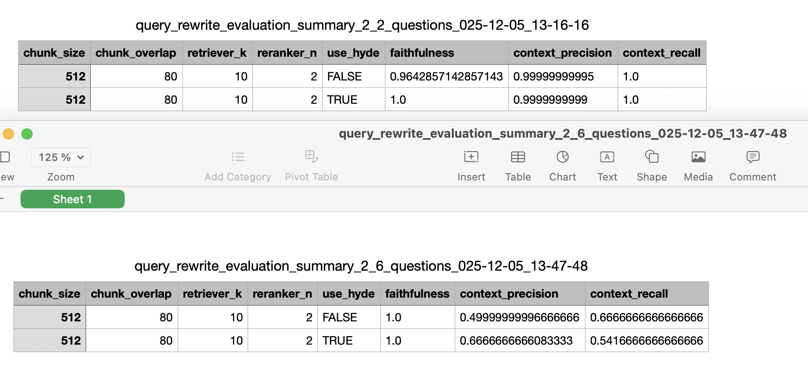

## 🫁 Air Pollution & COPD – RAG Chatbot

A question-answering chatbot built using Retrieval-Augmented Generation (RAG), designed to explain scientific findings from the research article:

**“Air pollution and chronic obstructive pulmonary disease (COPD)”**

👉 **Live App:** https://rag-chatbot-airpollution.streamlit.app/  
👉 The PDF can also be downloaded inside the app.

The chatbot reads the paper, retrieves the most relevant parts, and answers questions using only verified information from the article.

---

## 🎯 What This Project Does

This project builds an intelligent assistant that can:

- Answer medical and scientific questions about COPD and air pollution  
- Retrieve and reference correct sections of the research paper  
- Avoid hallucinations and stay fully grounded in the PDF  
- Provide clear explanations for complex biological mechanisms  
- Combine information across multiple sections  

---

## 🧠 Development Process

The system was built through several improvement stages:

### 1. Baseline RAG  
Initial retrieval + generation pipeline to observe weaknesses.

### 2. Chunking Optimization  
Experimented with multiple configurations.  
**Best performing:**  
- `chunk_size = 512`  
- `chunk_overlap = 80`

### 3. Reranking  
Added a reranker (`reranker_n = 2`) to improve retrieval precision.

### 4. Query Rewriting + HyDE  
Two major upgrades:
- **Condense+Context rewriting** clarifies user questions  
- **HyDE** creates a hypothetical answer to improve search relevance  

This made the system much better at answering complex, multi-part questions.

### 5. Final Tuning  
Adjusted parameters to maximize grounding and robustness.

---

## 📊 Evaluation Results

Two evaluation rounds were performed:

### ✅ Round 1 — 2 simple questions  
High metrics across faithfulness, precision, and recall.

### ✅ Round 2 — 6 advanced questions  
These required combining:
- mechanisms  
- pollutant-specific effects  
- mortality comparisons  
- regional differences  

**Key conclusions:**
- 🟢 **Faithfulness = 1.0 → zero hallucinations**  
- 🟡 Precision dropped only because the questions became more difficult  
- The chatbot still produced accurate, well-supported explanations  

**Overall:**  
The system remains reliable even on challenging scientific queries.

---

## ✨ Understanding Misspellings & Short Queries

The chatbot is also robust to **typos, shorthand, and very short prompts**.  
It can correctly interpret user intent even when questions look like:

- “what about the UK?”  
- “mortality?”  
- “copd mechansims?” (with misspellings)  

This is possible because of:

### 🧩 **Condense+Context query rewriting**  
Automatically rewrites unclear inputs into structured scientific queries.

### 🧩 **HyDE (Hypothetical Document Embeddings)**  
Generates a temporary synthetic answer to improve retrieval quality.

🔥 These two techniques combined allow the chatbot to understand intent  
—even when the input is short, vague, or misspelled—  
while *still staying fully grounded in the PDF*.

---

## 🖼️ Evaluation Summary Images

(Add this image to your repo at: `images/summaries.png`)

---

## 🚀 Try the App

👉 https://rag-chatbot-airpollution.streamlit.app/

Ask scientific questions, explore the PDF, and test the retrieval accuracy in real time.
