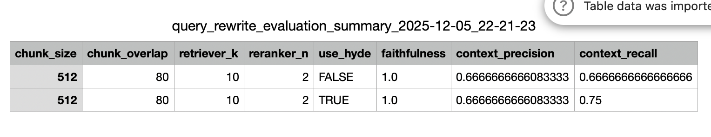

## 🫁 Air Pollution & COPD – RAG Chatbot

A question-answering chatbot built using Retrieval-Augmented Generation (RAG), designed to explain scientific findings from the research article:

**“Air pollution and chronic obstructive pulmonary disease (COPD)”**

👉 **Live App:** https://rag-chatbot-airpollution.streamlit.app/  
👉 The PDF can also be downloaded inside the app.

The chatbot reads the paper, retrieves the most relevant parts, and answers questions using only verified information from the article.

---

## 🎯 What This Project Does

This project builds an intelligent assistant that can:

- Answer medical and scientific questions about COPD and air pollution  
- Retrieve and reference correct sections of the research paper  
- Avoid hallucinations and stay fully grounded in the PDF  
- Provide clear explanations for complex biological mechanisms  
- Combine information across multiple sections  

---

## 🧠 Development Process

The system was built through several improvement stages:

### 1. Baseline RAG  
Initial retrieval + generation pipeline to observe weaknesses.

### 2. Chunking Optimization  
Experimented with multiple configurations.  
**Best performing:**  
- `chunk_size = 512`  
- `chunk_overlap = 80`

### 3. Reranking  
Added a reranker (`reranker_n = 2`) to improve retrieval precision.

### 4. Query Rewriting + HyDE  
Two major upgrades:
- **Condense+Context rewriting** clarifies user questions  
- **HyDE** generates a hypothetical answer to improve retrieval quality  

This dramatically improves performance on complex, multi-part questions.

### 5. Final Tuning  
Adjusted parameters to maximize grounding and recall.

---

## 📊 Evaluation Results (6 Questions)

This evaluation used **six challenging scientific questions**, each requiring:

- Mechanistic biological explanation  
- Pollutant-specific comparisons (PM2.5, PM10, NO₂, O₃, SO₂)  
- Mortality + prevalence interpretation  
- Regional differences (UK, China, Europe)  
- Reading epidemiological tables  
- Synthesizing information across multiple PDF sections  

### **Final Scores (6-Question Evaluation)**  
- 🟢 **Faithfulness = 1.0 → zero hallucinations**  
- 🔵 Strong context recall  
- 🟡 Lower precision — expected because the questions became much harder  

---

## 📝 Interpretation of the Evaluation Summary

These six questions were **intentionally much harder** than standard RAG benchmarks.  
They require deep reasoning rather than simply retrieving one paragraph.

**Why precision drops on hard questions:**

- Hard questions require *multiple* correct contexts  
- The retriever brings in several related chunks  
- Some chunks contain only partial relevance  
- Ragas counts those as “lower precision,” even if the answer is excellent  

This is **normal** and expected for multi-topic scientific reasoning tasks.

### ⭐ What matters most: **Faithfulness = 1.0**  
The chatbot **never hallucinated** and **every answer was grounded** in the PDF.

### ⭐ Recall stays strong  
It consistently retrieves relevant scientific sections.

### ⭐ Final verdict  
The system remains:

- **Scientifically reliable**  
- **Highly accurate**  
- **Ideal for biomedical question answering**  
- **Robust for multi-step reasoning**  

---

## ✨ Understanding Misspellings & Short Queries

The chatbot understands questions even when they contain:

- Typos  
- Short phrases  
- Shorthand  
- Country-only queries  
- Incomplete scientific terms  

Examples it handles correctly:

- “what about the UK?”  
- “mortality?”  
- “copd mechansims?”  
- “pollution effects china?”  

Thanks to:

### 🧩 **Condense+Context Query Rewriting**  
It rewrites unclear inputs into full, structured scientific questions.

### 🧩 **HyDE (Hypothetical Document Embeddings)**  
Creates a synthetic answer to improve retrieval precision.

🔥 This allows the chatbot to understand what the user *meant*,  
while still staying **100% grounded in the PDF**.

---

## 🖼️ Evaluation Summary Images



---

## 📦 Project Structure

```text
RAG-Project/
│
├── data/                      # Text file used for RAG indexing
│   └── air_pollution.txt
│
├── data_pdf/                  # PDF only for user download (NOT used for RAG)
│   └── air_pollution.pdf
│
├── evaluation/                # Evaluation pipeline using Ragas
│   ├── evaluation_config.py
│   ├── evaluation_engine.py
│   ├── evaluation_model_loader.py
│   ├── evaluation_questions.py
│   ├── evaluation_helper_functions.py
│   └── evaluation_results/
│
├── images/                    # Evaluation summary visuals
│   └── summary_.png
│
├── src/                       # Core RAG implementation
│   ├── config.py              # Global configuration (incl. vector_store_v4 path)
│   ├── engine.py              # Chat engine with HyDE, reranking, query rewriting
│   └── model_loader.py        # LLM + embedding initializers
│
├── local_storage/             # Auto-generated index & embeddings (git-ignored)
│   ├── embedding_model/
│   ├── vector_store/          # Old versions (ignored)
│   └── vector_store_v4/       # Current production index
│
├── .gitignore                 # Ensures vector stores & caches are NOT committed
├── app.py                     # Streamlit UI for the chatbot
├── evaluate.py                # Script to run full evaluation
├── main.py                    # Optional local CLI chatbot
├── requirements.txt           # Project dependencies
└── README.md                  # Documentation

---
## 🚀 Try the App

👉 **https://rag-chatbot-airpollution.streamlit.app/**

Ask scientific questions, explore the PDF, and test the retrieval accuracy in real time.
